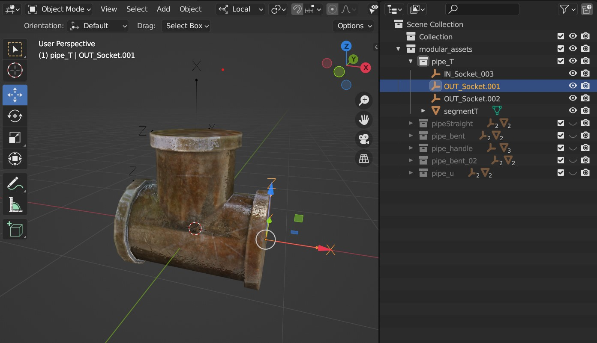
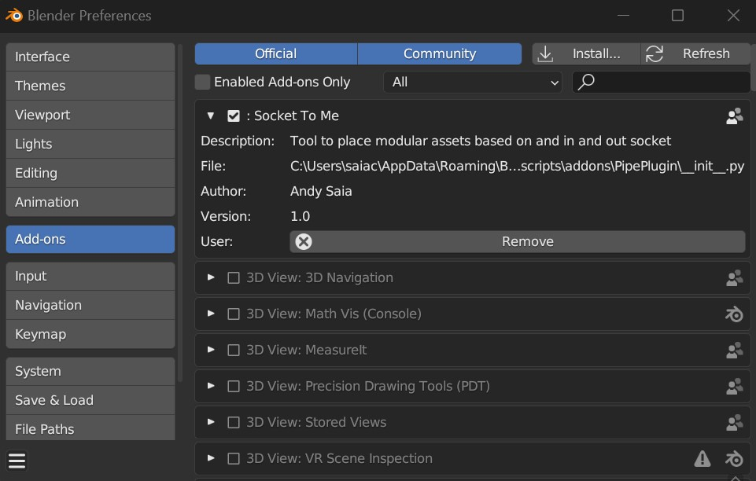
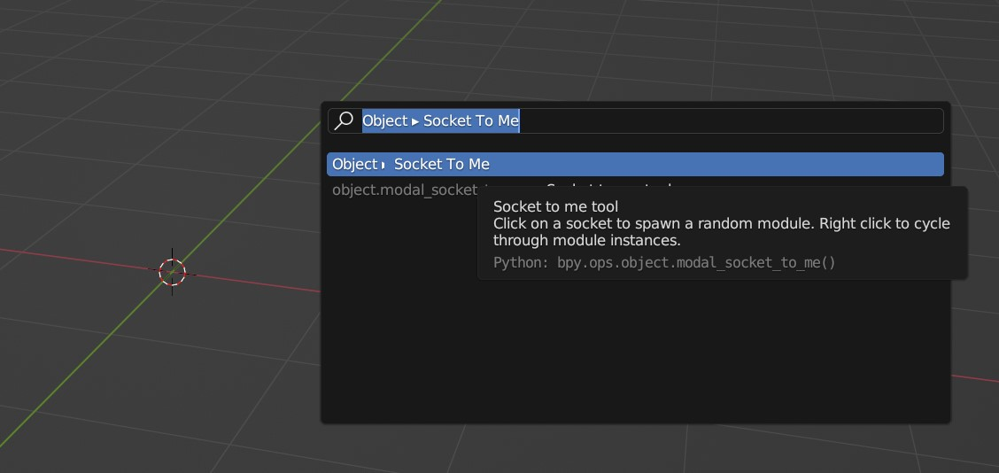

# Socket To Me blender addon

The Socket To Me addon allows you to quickly place networks of modular asset instances that are connected by user defined socket transforms.

This is ideal for any kind of branching set of assets such as pipes, roads, corridors, and more.
 
 

## How to use
* Create a parent collection named "modular_assets".
* Inside the parent collection, place collections you'd like to instance.
* Ensure that the collections have one Empty object with the prefix IN_ and as many OUT_ empty objects as you need.

### Install and enable the addon in the blender preferences:

### After enabling the addon use F3, or Tab for industry standard keymapping, to search and type "Socket To Me":

Examples folder uses the modular pipe assets by user DJMaesen on [Sketchfab](https://sketchfab.com/3d-models/modular-pipes-f43677d2d1014669b7c7a9f220d46eb3)